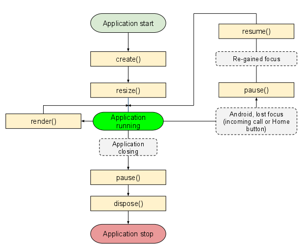

<h1>libGDX Notes</h1> 

<h2>1. Documentation for libGDX</h2> 
- Documentation to get started: https://libgdx.badlogicgames.com/documentation/gettingstarted/Creating%20Projects.html#structure-of-libgdx-projects
- Documentation on the Framework: https://github.com/libgdx/libgdx/wiki

Generating a jar file:

    java -jar desktop.jar

<h2>2. Application LifeCycle </h3>

An ApplicationListener interface is created when the application is created, resume, rendering, pause, or destroyed. The ApplicationListener interface follows the standard activity life cycle.

We can hook into these life cycle events by implementing the ApplicationListener interface. Another option is to derive from the ApplicationAdapter class if not all the interface methods are needed.

__Hooks: are points in the provided code where the developer is able to add additional code to modify the behaviour__

There are several main states in the lifecycle: 
- create: This is called when the application is created
- render: This is called by the game loop form the application when ever rendering needs to be performed. Note that game logic is usially performed in this method
- resize: This is called every time the game screen is resized. This is also called once after the create method. 
- pause: This method applies on android. The method is called upon certain events from the phone. Ex, incoming call, home button pressed
- resume: This method is only called on android. This method is called when application resumes from paused state
- dispose: This is called when the application is destroyed. This is preceded by a call to the pause method

There is no explicit main loop. This is due to the nature of how Android and JavaScript works. However, the render method can be considered as a game loop. (I'm not sure what that means. There is an implicit loop in Android and JavaScript apps?)

<h2>3. Modules</h2>

The modules that will be crucial for any kind of game development:
- Input: Unified input model and handler. Supports keyboard, touchscreen, mouse
- Graphics: Enables image drawing
- Files: Abtracts file access. Provides convenient file access for read write operations 
- Audio: Allows for sound recording and playback 
- Networking (cool!): Allows for simple HTTP get/post request, and TCP server/client socket comms

**It will be important to think about what to add to these modules**
**This may help in determining the project structure during implementation**

<h2>4. Starters</h2>
It is recommended that I should use the modern backend for new projects. Follow these steps:

- https://github.com/libgdx/libgdx/wiki/Starter-classes-and-configuration

Logging is provided

<h2>5. Useful Features</h2>

The following features may be useful for developing a VN game:

- File handling: would be useful for script reading
- 2D Animation: Basic animation. For extra details 
- Sprites: Sprites for characters, background, textbox etc
- Viewport: Dimensions of what can be seen from the camera
- Orthographic Camera: Movable camera. rotate, zoom effects.
- ViewPort: handles aspect ratios, in case window is resized
- Continuous Rendering: disabling this would be more efficient as not much rendering is required for VNs
- Asset Manager: would be useful for loading assets and destroying assets. also capable of asynchronous loading screens
